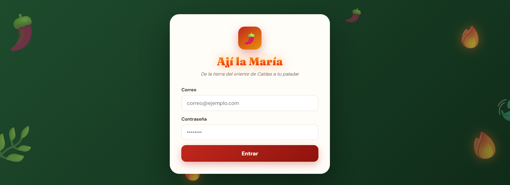
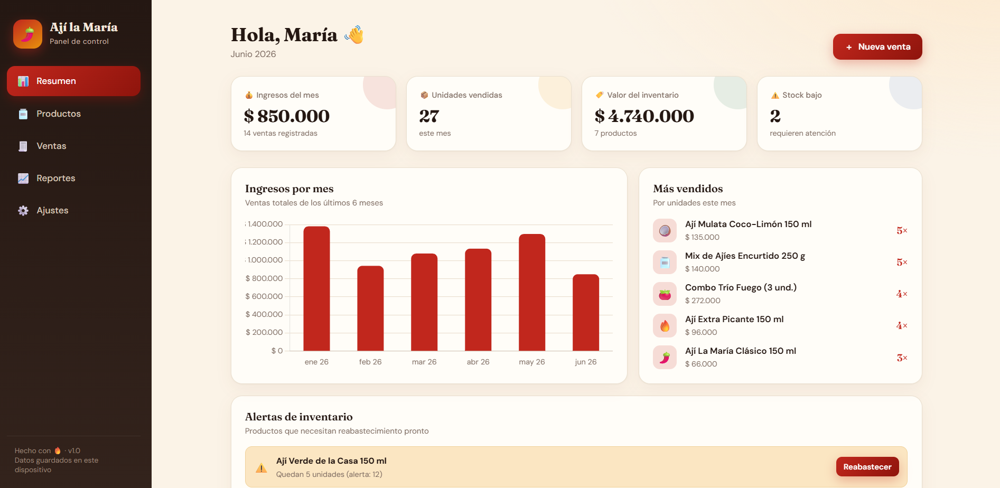
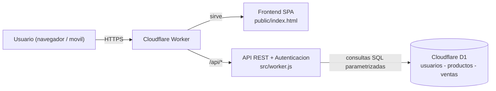

<h1 align="center">🌶️ Ají la María · Panel de Control</h1>

<p align="center">
  <em>Aplicación web full-stack para administrar el inventario, las ventas y los reportes<br>de una marca de ají artesanal del oriente de Caldas, Colombia.</em>
</p>

<p align="center">
  
  
  
  
  
</p>

<p align="center">
  🔗 <strong>Demo en vivo:</strong> <a href="https://aji.socap21.uk">aji.socap21.uk</a> &nbsp;·&nbsp; <em>(requiere cuenta de acceso)</em>
</p>

---

## 📋 Descripción

**Ají la María · Panel de Control** es una aplicación web *serverless* que reemplaza
el manejo manual (cuadernos y hojas de cálculo) de un negocio real de ají artesanal.
Permite controlar el inventario, registrar ventas que descuentan el stock
automáticamente, visualizar reportes de rentabilidad y administrar el acceso de
varios usuarios — todo desde cualquier dispositivo, con los datos centralizados en
la nube.

Construida íntegramente sobre la plataforma de **Cloudflare** (Workers + D1), sin
servidores que mantener y con despliegue global en segundos.

<p align="center">
  
  &nbsp;
  
</p>

---

## ✨ Características

- **📊 Dashboard** con indicadores clave: ingresos del mes, unidades vendidas, valor
  total del inventario y alertas de stock bajo, con gráficas de los últimos meses.
- **🫙 Gestión de productos e inventario**: catálogo con precio, costo, margen de
  ganancia, nivel de picante y control de stock con alertas configurables.
- **🧾 Registro de ventas** que descuenta el inventario de forma automática y atómica,
  con historial filtrable por mes.
- **📈 Reportes de rentabilidad** por producto (unidades, ingresos, ganancia y margen)
  y gráficas de participación de ventas.
- **🔐 Autenticación segura** con roles de administrador y staff.
- **👥 Gestión de usuarios** para dar acceso al equipo del negocio.
- **📱 Diseño responsive** tipo app, pensado para usarse en computador o celular.
- **💾 Respaldo** de datos exportable en un clic.

---

## 🛠️ Stack tecnológico

| Capa | Tecnología |
|------|------------|
| **Frontend** | HTML, CSS y JavaScript *vanilla* (SPA), [Chart.js](https://www.chartjs.org/) para gráficas |
| **Backend / API** | [Cloudflare Workers](https://workers.cloudflare.com/) (JavaScript) |
| **Base de datos** | [Cloudflare D1](https://developers.cloudflare.com/d1/) (SQLite distribuida) |
| **Autenticación** | Web Crypto API (PBKDF2 + SHA-256), sesiones por cookie `HttpOnly` |
| **Infraestructura** | Dominio + DNS + SSL gestionados en Cloudflare; despliegue con Wrangler |

> Sin frameworks pesados ni dependencias en tiempo de ejecución: el frontend es un
> único archivo y el backend, un solo Worker. Carga rápida y mantenimiento simple.

---

## 🏗️ Arquitectura



Un mismo Worker sirve el frontend estático **y** expone la API. Las peticiones a
`/api/*` se procesan en el backend; cualquier otra ruta entrega la interfaz.

```
ajilamaria-panel/
├── public/
│   └── index.html          # Frontend (SPA): dashboard, productos, ventas, reportes
├── src/
│   └── worker.js           # Backend: API REST + autenticación + acceso a D1
├── schema.sql              # Definición de las tablas (D1)
├── seed.sql                # Datos de ejemplo (opcional)
├── wrangler.toml           # Configuración de Cloudflare (Worker + binding D1)
├── package.json            # Scripts de despliegue y dependencias
├── .github/workflows/      # CI/CD opcional (despliegue manual)
├── docs/                   # Capturas de pantalla
├── SECURITY.md             # Medidas de seguridad
├── LICENSE
└── README.md
```

---

## 🚀 Instalación y despliegue

### Requisitos
- [Node.js](https://nodejs.org) 18 o superior
- Una cuenta de [Cloudflare](https://dash.cloudflare.com) (el plan gratuito es suficiente)

### Pasos

```bash
# 1. Clonar el repositorio
git clone https://github.com/TU-USUARIO/ajilamaria-panel.git
cd ajilamaria-panel

# 2. Iniciar sesión en Cloudflare
npx wrangler login

# 3. Crear la base de datos D1
npx wrangler d1 create ajilamaria
#    Copia el "database_id" que devuelve y pégalo en wrangler.toml

# 4. Crear las tablas
npm run db:schema

# 5. (Opcional) Cargar productos de ejemplo
npm run db:seed

# 6. Publicar
npm run deploy
```

La primera vez que abras la URL verás **"Crea tu cuenta"**: esa primera cuenta queda
como administrador. Desde *Ajustes → Usuarios* podrás dar acceso a más personas.

> Guía detallada paso a paso (pensada para Windows) en [GUIA-DESPLIEGUE.md](GUIA-DESPLIEGUE.md).

### Desarrollo local

```bash
npm run dev      # servidor de desarrollo (usa la D1 remota)
```

### CI/CD (opcional)
El repositorio incluye un *workflow* de GitHub Actions para desplegar automáticamente.
Para activarlo, agrega en **Settings → Secrets → Actions** el secret
`CLOUDFLARE_API_TOKEN` (genéralo en el panel de Cloudflare con permiso *Edit Workers*).
Por defecto el *workflow* solo se ejecuta manualmente.

---

## 🔐 Seguridad

La seguridad fue una prioridad del proyecto. Entre las medidas implementadas:

- Contraseñas cifradas con **PBKDF2** (100.000 iteraciones) y *salt* único por usuario.
- Sesiones con **cookies `HttpOnly` + `Secure` + `SameSite=Strict`**.
- **Consultas SQL parametrizadas** (prevención de inyección).
- **Registro cerrado** tras la primera cuenta y control de acceso por roles.

Más detalles en [SECURITY.md](SECURITY.md).

---

## 🗺️ Roadmap

- [ ] Exportación de reportes a PDF.
- [ ] Integración con pasarela de pagos / facturación electrónica.
- [ ] Notificaciones de stock bajo por correo o WhatsApp.
- [ ] Soporte para múltiples puntos de venta / sucursales.
- [ ] Modo offline con sincronización.

---

## 📄 Licencia

Distribuido bajo la licencia **MIT**. Ver [LICENSE](LICENSE).

---

## 👤 Autor

**Oscar Patiño** — Desarrollador full-stack · Manizales, Colombia

- 💼 LinkedIn: [linkedin.com/in/TU-USUARIO](https://www.linkedin.com/in/TU-USUARIO)
- 🌐 Proyecto en vivo: [aji.socap21.uk](https://aji.socap21.uk)

<p align="center"><sub>Construido con 🔥 sobre Cloudflare Workers + D1</sub></p>
